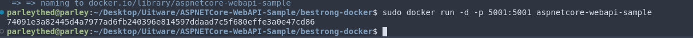
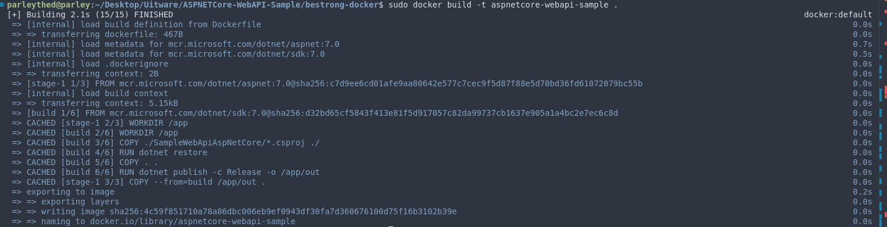
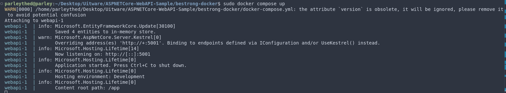
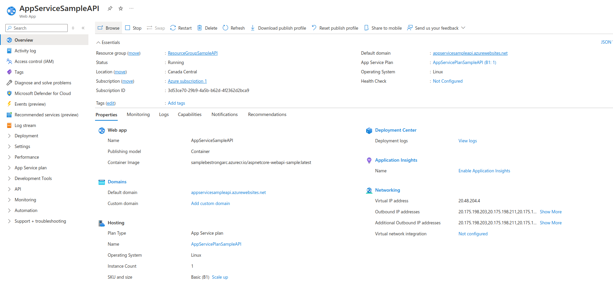
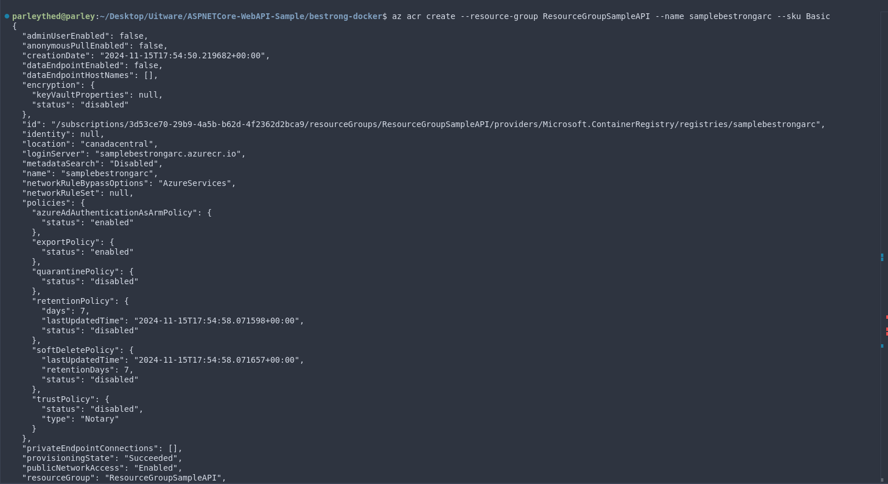
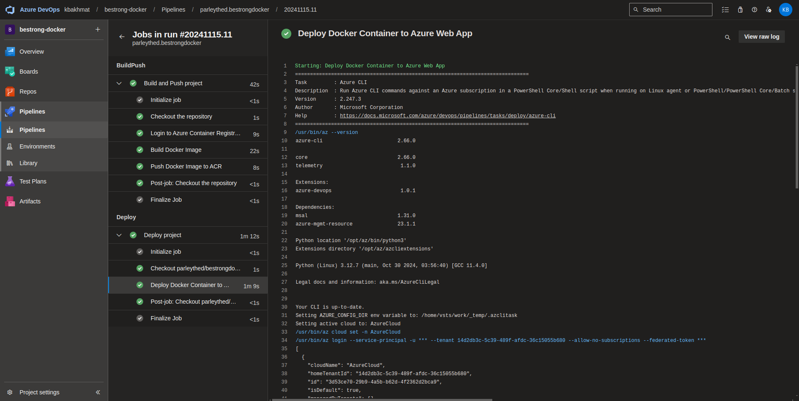
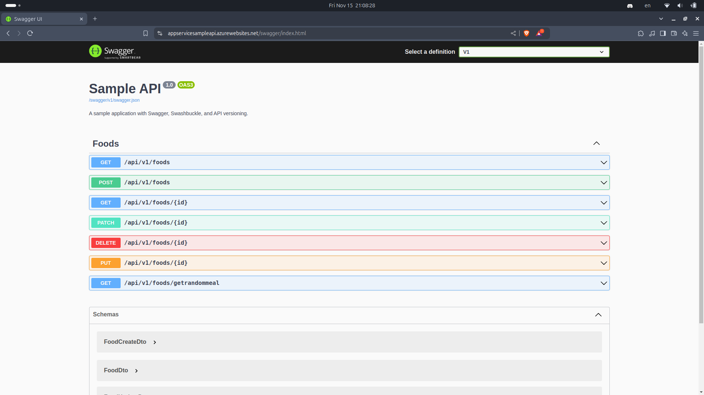
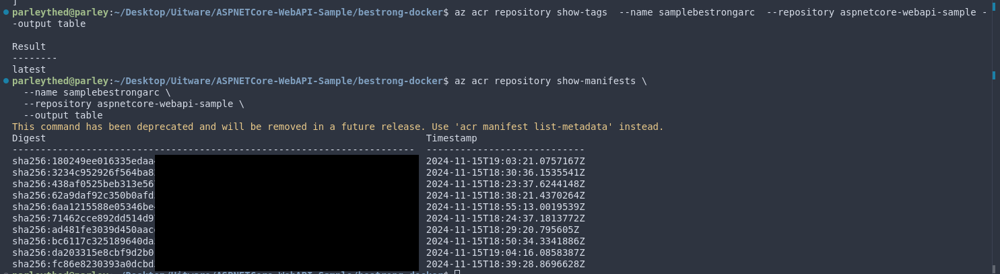

# bestrong-docker

## Task
- 1) You need to create your own repo in Github and clone https://github.com/FabianGosebrink/ASPNETCore-WebAPI-Sample
- 2) Create a Dockerfile that will build application and run it. 
- 3) Create a dockercompose.yml file that will inlude build (use local build context) and run stages, for local testing purposes, commit this file to repo. 
- 4) Write your own Azure DevOps build flow using yaml syntax and commit it into your GitHub repo. Build and deploy from the main branch. Build on PR.
- 5) Although you have multiple options to deploy the dockerized application, your manager heard about Azure App Service and knows that you have Terraform code for that. You should determine whether it's necessary to use the old Terraform code, Terraform code with modified configuration, or choose another platform and write Terraform code for it. Although you should write Terraform configuration, there's no requirement to implement CI/CD for it (but you can use your previous pipelines to address this and bring additional value).


## Dockerfile
### Dockerfile configuration.
```
# Build Stage
FROM mcr.microsoft.com/dotnet/sdk:7.0 AS build
WORKDIR /app

COPY ./SampleWebApiAspNetCore/*.csproj ./
RUN dotnet restore

COPY . .
RUN dotnet publish -c Release -o /app/out

# Runtime Stage
FROM mcr.microsoft.com/dotnet/aspnet:7.0
WORKDIR /app
COPY --from=build /app/out .

EXPOSE 5001

ENV ASPNETCORE_URLS=http://+:5001
ENV ASPNETCORE_ENVIRONMENT=Development

ENTRYPOINT ["dotnet", "SampleWebApiAspNetCore.dll"]
```

### Building the container, making the app accessible on port 5001.


### Building the container, making the app accessible on port 5001.


### Checking the app accessible.


## Docker-compose up
### Docker-compose.yml configuration.
```
version: '3.8'

services:
  webapi:
    image: webapi
    build:
      context: .
      dockerfile: Dockerfile
    ports:
      - "5001:5001"
    environment:
      - ASPNETCORE_ENVIRONMENT=Development
      - ASPNETCORE_URLS=http://+:5001
```

### Create and start container using Docker Compose/


## Terraform configuration
```
terraform {
  required_version = ">= 0.12"
  required_providers {
    azurerm = {
      source  = "hashicorp/azurerm"
      version = "3.116.0"
    }
  }
}

provider "azurerm" {
  features {}
}

resource "azurerm_resource_group" "rg" {
  name     = var.azurerm_resource_group_name
  location = var.azurerm_resource_group_location
}

resource "azurerm_app_service_plan" "app_service_plan" {
  name                = var.app_service_plan_name
  location            = azurerm_resource_group.rg.location
  resource_group_name = azurerm_resource_group.rg.name
  kind                = "Linux"

  sku {
    tier = "Basic"
    size = "B1"
  }

  reserved = true
}

resource "azurerm_app_service" "app" {
  name                = var.app_service_name
  location            = azurerm_resource_group.rg.location
  resource_group_name = azurerm_resource_group.rg.name
  app_service_plan_id = azurerm_app_service_plan.app_service_plan.id

  site_config {
    linux_fx_version = "DOCKER|katerynabakhmat/aspnetcore-webapi-sample:latest"
  }

  app_settings = {
    WEBSITES_ENABLE_APP_SERVICE_STORAGE = "false"
  }
}
```

### App Service for this task


### Azure Container Registry



## Pipeline 
### Pipeline code [here](./pipeline.yml)
### Result of running pipeline


### Checking app in App Service



### Optional
### I checked if images pushed in ACR and after each build creates a new image layer with its own hash, confirming that the image is updated after each pipeline run. 
